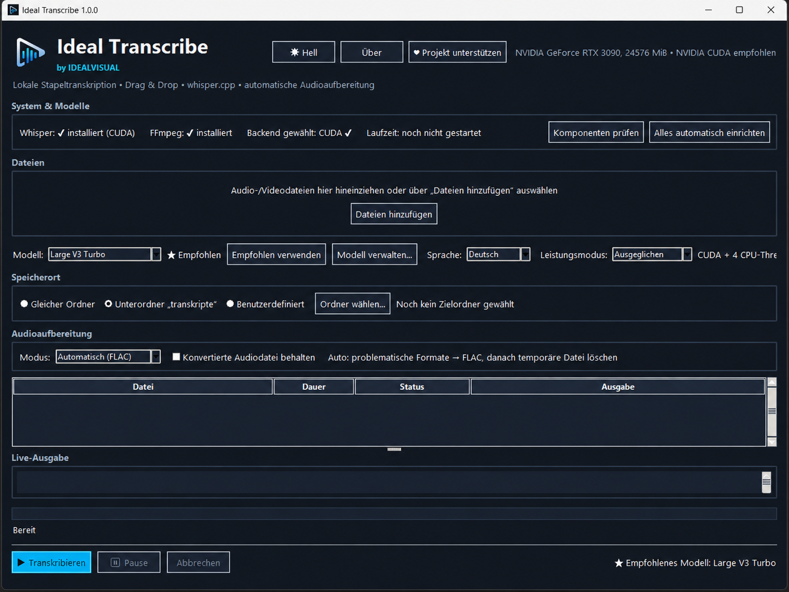
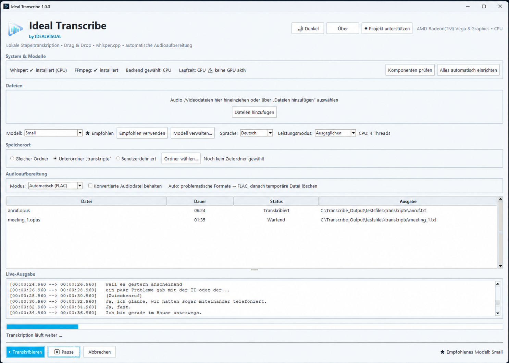
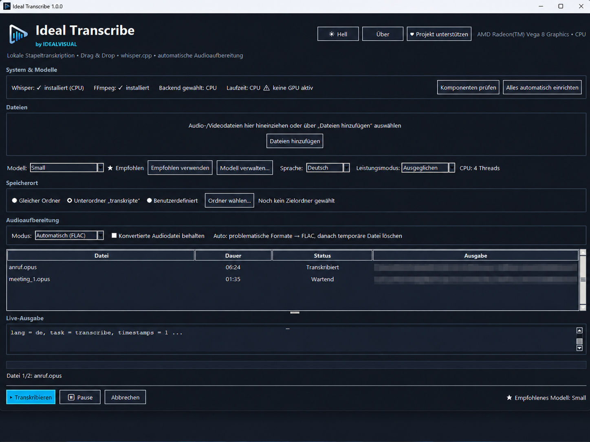
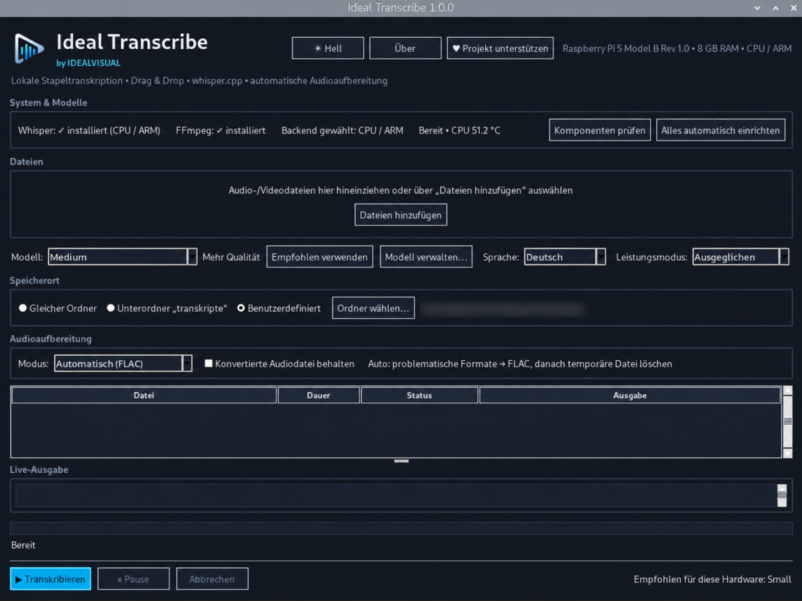

# Ideal Transcribe

**Private, local speech-to-text for Windows and Raspberry Pi — powered by `whisper.cpp`.**

[](https://github.com/hosntrigger/IdealTranscribe/releases/latest)
[](https://github.com/hosntrigger/IdealTranscribe/releases)


Ideal Transcribe by **IDEALVISUAL** turns audio and video files into text **on your own device**. No cloud transcription service, no account and no subscription are required for transcription.

> **Download:** [Windows](https://github.com/hosntrigger/IdealTranscribe/releases/latest) · [Raspberry Pi](https://github.com/hosntrigger/IdealTranscribe/releases/latest)

## Screenshots

### Windows with NVIDIA CUDA

<p align="center">
  
</p>

<details>
<summary><strong>More screenshots — Windows light theme, live transcription and Raspberry Pi</strong></summary>

<br>

| Windows — Light theme | Windows — Live transcription |
| --- | --- |
|  |  |

### Raspberry Pi

<p align="center">
  
</p>

</details>

## Why Ideal Transcribe?

- **Local-first privacy** — media stays on your device during transcription.
- **Windows + Raspberry Pi** — the same workflow on desktop and ARM/CPU systems.
- **NVIDIA CUDA on Windows** — automatically preferred when supported.
- **Batch workflow** — queue multiple files and keep working through them.
- **Whisper model manager** — install, select, update and remove models from the app.
- **Practical exports** — TXT, SRT and VTT.
- **Audio preparation built in** — automatic FLAC conversion for problematic formats.
- **No cloud lock-in** — based on `whisper.cpp`, with local model execution.

## Features

- drag & drop and file picker
- batch queue with progress and live output
- pause / resume / cancel
- safe close confirmation during active jobs
- selectable Whisper models
- configurable output folder
- FLAC / WAV / MP3 / original-audio preparation modes
- Light / Dark theme
- German / English interface with persistent language selection
- Windows CPU/CUDA detection
- Raspberry Pi ARM/CPU profiles
- Raspberry Pi temperature protection and batch cooldown

## Quick start

### Windows

1. Open the [latest release](https://github.com/hosntrigger/IdealTranscribe/releases/latest).
2. Download the current **Windows FINAL** ZIP from the latest release.
3. Extract the ZIP.
4. Start **`IdealTranscribe.exe`**.
5. Let Ideal Transcribe set up the required components/model, then add an audio or video file.

**Windows SmartScreen:** the current EXE is not digitally signed, so Windows may show **“Windows protected your PC”** on first launch. This can happen with new unsigned applications. If you downloaded the file from this repository, use **More info → Run anyway** if you want to proceed.

### Raspberry Pi

1. Open the [latest release](https://github.com/hosntrigger/IdealTranscribe/releases/latest).
2. Download the current **Raspberry Pi FINAL** ZIP from the latest release.
3. Extract it and open a terminal in the extracted folder.
4. Run:

```bash
chmod +x install.sh
./install.sh
```

The installer creates the **Ideal Transcribe** application/menu entry. An existing `~/whisper.cpp` installation and models under `~/whisper.cpp/models` can be reused.

## Output formats

| Format | Best for |
| --- | --- |
| TXT | plain transcripts and notes |
| SRT | subtitles with timestamps |
| VTT | web/video subtitles |

## Privacy

Transcription runs locally. Audio and video files do not need to be uploaded to a cloud transcription service. Internet access is only needed when downloading components or models requested by the user.

## Who is it for?

Ideal Transcribe is useful when you want to transcribe recordings locally — for example interviews, meetings, voice notes, archived recordings or video material — especially when privacy or offline operation matters.

## Roadmap

Planned ideas include optional **local AI post-processing** for transcript correction, formatting, summaries and structured analysis while preserving the original transcript. See [the roadmap](docs/ROADMAP.md).

## Feedback

Found a bug or have an idea? Use [GitHub Issues](https://github.com/hosntrigger/IdealTranscribe/issues). Feature requests are welcome.

## Project support

Ideal Transcribe is free for permitted noncommercial use. If the project is useful to you, voluntary support helps further development:

**https://paypal.me/gottschn**

## License

Ideal Transcribe source code and official builds are provided under the **PolyForm Noncommercial License 1.0.0**.

- permitted noncommercial use: free
- commercial/business use: separate commercial license required

See [LICENSE](LICENSE) and [COMMERCIAL_LICENSE.md](COMMERCIAL_LICENSE.md). Third-party software retains its own licenses; see [THIRD_PARTY_NOTICES.md](THIRD_PARTY_NOTICES.md).
